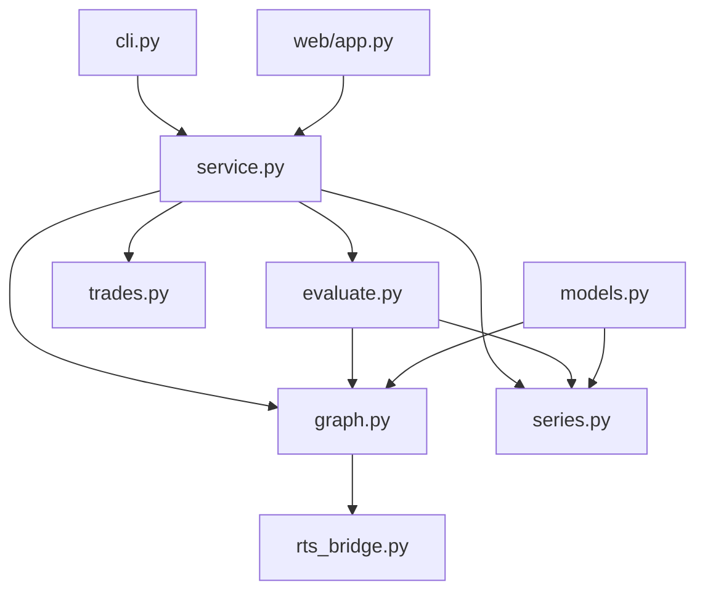

# Trade criteria visualizer — design rationale (Candidate B: Criteria Graph Center)

## 1. Problem

RealTest strategies express entries and exits as compound formulas (`EntrySetup`, `ExitRule`, limits/stops) that reference named `Data:` items, built-ins (`C`, `BarsHeld`), and nested expressions. When a trade fires, it is hard to see **which sub-conditions flipped when** and how intermediate values evolved across preceding bars.

The rt-grammar repo today validates `.rts` syntax only — no AST, no evaluator, no trade replay. v1 of the trade criteria visualizer should:

- **In scope:** Parse strategy criteria into a dependency graph; accept a trades CSV plus a bar-value source; for each trade+phase (entry/exit), produce a bar-by-bar timeline of criterion node values until the signal bar; expose results via CLI and a simple web UI.
- **Out of scope:** Full RealTest semantics, portfolio-level state (`S.*`), breadth operators, walk-forward parameter sweeps, order-fill simulation, or replacing RealTest as a backtester.

The central question v1 answers: *"For this trade's entry (or exit), how did each piece of the criterion behave on each bar leading up to the signal?"*

---

## 2. Usage (caller's view)

### README summary

Callers interact with three concepts only:

1. **`CriteriaGraph`** — built once from an `.rts` file; holds formulas, refs, and dependency edges.
2. **`BarSeries`** — pluggable per-bar value backend (CSV export in v1, mock for tests, evaluator later).
3. **`CriteriaTimelineService`** — given graph + series + trades CSV, returns **`TradeCriteriaView`** per trade and phase.

Parsing, graph construction, series slicing, and per-bar evaluation are **not** part of the public API.

### Call site 1 — CLI operator

```bash
python -m criteria_viz \
  --rts tests/valid/strategy_elements.rts \
  --trades tests/valid/stub_trades.csv \
  --series tests/valid/stub_values.csv \
  --trade 0 \
  --phase entry \
  --lookback 30 \
  --serve --port 8765
```

Opens a local page: left panel = criteria graph (nodes colored by value on selected bar); bottom scrubber = bar timeline; right panel = trade metadata and signal summary.

### Call site 2 — notebook / script

```python
from pathlib import Path
from criteria_viz import (
    build_criteria_graph,
    CsvBarSeries,
    CriteriaTimelineService,
    TradePhase,
)

graph = build_criteria_graph(Path("example_strategy.rts"))
service = CriteriaTimelineService(
    graph=graph,
    series=CsvBarSeries.from_csv(Path("export_values.csv")),
    trades_csv=Path("trades.csv"),
)

for phase in (TradePhase.ENTRY, TradePhase.EXIT):
    view = service.view_for_trade(0, phase)
    if view is None:
        continue  # strategy has no formula for this phase
    for snap in view.timeline:
        if snap.changed:
            print(snap.date, {view.graph.node_label(n): snap.values[n] for n in snap.changed})
```

### Call site 3 — web app embedding

```python
from criteria_viz.web import create_app
from criteria_viz import build_criteria_graph, CsvBarSeries, CriteriaTimelineService

graph = build_criteria_graph("example_strategy.rts")
service = CriteriaTimelineService(graph, CsvBarSeries.from_csv("values.csv"), "trades.csv")
app = create_app(service)  # GET /api/trades, GET /api/view?trade=0&phase=entry
# uvicorn criteria_viz.web:app --reload
```

The UI consumes `TradeCriteriaView.to_json()`; it never touches Lark or CSV column layout.

---

## 3. Shape

### Core data structures

```
CriteriaGraph
├── nodes: dict[NodeId, CriterionNode]
├── roots: dict[(strategy_name, TradePhase), NodeId]
└── data_items: set[str]          # named Data: items referenced anywhere

CriterionNode
├── id, label, kind               # REF | LITERAL | UNARY | BINARY | CALL | DATA_REF
├── expr_source: str                # original RTS substring for tooltips
├── deps: tuple[NodeId, ...]        # evaluation order follows topo sort
└── meta: dict                      # operator, function name, data item name, …

BarSeries (protocol)
├── symbol_dates(symbol) -> list[date]
├── value(symbol, item_or_builtin, bar_index) -> float | bool | None
└── items_available(symbol) -> set[str]

TradeCriteriaView
├── trade: TradeRecord
├── phase: TradePhase
├── strategy: str
├── root_id: NodeId
├── graph: CriteriaGraph            # possibly pruned to reachable subgraph
├── timeline: list[BarSnapshot]     # lookback .. signal bar
├── signal_bar: BarSnapshot
└── root_satisfied: bool

BarSnapshot
├── bar_index, date
├── values: dict[NodeId, Scalar]
└── changed: tuple[NodeId, ...]     # vs previous bar (for animation)
```

### Module map

Deliberately **not** organized as load → validate → transform → save. Modules cluster around the graph and the timeline projection service.

```
criteria_viz/
├── __init__.py          # public re-exports only
├── models.py            # TradeRecord, TradePhase, BarSnapshot, TradeCriteriaView
├── graph.py             # CriteriaGraph, CriterionNode, GraphBuilder
├── rts_bridge.py        # Lark parse tree → CriteriaGraph (internal)
├── series.py            # BarSeries protocol, CsvBarSeries, MockBarSeries
├── evaluate.py          # evaluate_graph(graph, series, symbol, bar_index) (internal)
├── service.py           # CriteriaTimelineService
├── trades.py            # trades CSV → TradeRecord list (internal)
├── cli.py               # argparse entry
├── web/
│   ├── app.py           # create_app(service), JSON API
│   └── static/          # minimal graph + timeline UI
├── rationale.md
└── README.md
```

Dependency direction:



### Public surface (`__init__.py`)

```python
__all__ = [
    "CriteriaGraph",
    "CriterionNode",
    "build_criteria_graph",
    "BarSeries",
    "CsvBarSeries",
    "MockBarSeries",
    "CriteriaTimelineService",
    "TradeCriteriaView",
    "TradePhase",
    "TradeRecord",
]
```

Everything in `rts_bridge`, `evaluate`, and `trades` stays private.

### Key signatures (sketches)

See the Python files in this directory for annotated stubs. The load-bearing flow:

```python
graph = build_criteria_graph(rts_path, strategy=None)  # -> CriteriaGraph
service = CriteriaTimelineService(graph, series, trades_csv)
view = service.view_for_trade(trade_index=0, phase=TradePhase.ENTRY)
# view.timeline[-1] is the signal bar; view.graph drives UI layout
```

`CriteriaTimelineService.view_for_trade`:

1. Resolve `TradeRecord` and strategy name (from CSV `Strategy` column or single-strategy default).
2. Pick root node: `graph.roots[(strategy, phase)]` — e.g. `EntrySetup` or `ExitRule`.
3. Compute bar window: `[signal_bar - lookback, signal_bar]` using trade date/time + `BarSeries.symbol_dates`.
4. For each bar in window, run `evaluate_graph` on the reachable subgraph; record `BarSnapshot` with `changed` diff.
5. Package `TradeCriteriaView` (pruned graph for UI, full timeline).

### Graph construction from RTS

`GraphBuilder` walks:

- `Data:` `data_item_decl` → one `DATA_REF` or subtree node per item (formula body becomes child nodes).
- `Strategy:` `EntrySetup`, `ExitRule`, `EntrySkip`, `ExitLimit`, `ExitStop`, … → phase roots (v1 prioritizes `EntrySetup` + `ExitRule`).
- `Library:` items referenced transitively are inlined or linked as `CALL` nodes.

Identifier resolution: bare names (`Oversold`) resolve to `Data:` items; unknown names become `REF` nodes (built-ins / position vars) that `BarSeries` must supply.

### BarSeries v1 contract

Expected export CSV (convention TBD with RealTest export; mock provided):

| Column | Meaning |
|--------|---------|
| `Date` | Bar date |
| `Symbol` | Ticker |
| `<DataItemName>` | Numeric/boolean columns for each referenced data item |
| `C`, `O`, `H`, `L`, `V`, … | Standard builtins as columns |

`MockBarSeries` generates synthetic series from graph literals for unit tests without RealTest.

---

## 4. Tradeoffs accepted

| Decision | Rationale |
|----------|-----------|
| **Graph-first, not pipeline-first** | The graph is persisted and reused across trades; evaluation is a projection onto `BarSeries`. Avoids recomputing structure per trade and supports UI layout stability. |
| **CSV bar backend in v1** | No evaluator in rt-grammar yet; exported values are good enough to prove visualization. Wrong values are a data problem, not a graph problem. |
| **Subset of strategy elements** | v1 roots: `EntrySetup`, `ExitRule`. Limits/stops and `EntrySkip` are follow-ups; graph model already supports additional roots. |
| **No AST file in repo** | `rts_bridge` builds `CriteriaGraph` directly from Lark tree via Transformer/Visitor; we do not commit a separate generic RTS AST package. |
| **Topological eval, not event sourcing** | Per bar we re-evaluate all nodes in dependency order. Simple and correct for v1; incremental eval is an optimization later. |
| **Single strategy focus per view** | Combined strategies and `Template:` inheritance resolved at graph-build time (flatten `Using:` chain). |
| **Boolean coercion** | RealTest truthiness rules approximated: non-zero numeric = true for logical nodes; document divergence from RealTest. |

---

## 5. Alternatives considered

### A — Export-first flat pipeline (rejected)

```
load_rts → validate → extract_criteria_table → load_trades → load_series
  → pivot_timeline → render_json → save
```

Flat stages treat criteria as rows in a table (trade_id, bar, item, value). Compound structure (AND/OR trees) is lost unless re-parsed each time. Graph layout, partial satisfaction, and shared sub-expressions across trades are awkward. Validation and export concerns dominate the module tree instead of the domain object.

### C — Evaluator-first (deferred)

Embed a mini RealTest formula evaluator and compute `Data:` items on the fly from OHLCV. Highest fidelity, largest scope. rt-grammar explicitly has no evaluator today; would duplicate RealTest and delay the visualizer. `BarSeries` protocol preserves this path without redesign.

### D — Lark JSON dump + jq (rejected)

Serialize parse tree to JSON and slice in the frontend. Exposes grammar noise, makes dependency extraction fragile, and pushes RTS knowledge into JavaScript. Fails the "small public surface" goal.

**Why B wins:** `CriteriaGraph` is the stable contract between RTS syntax, bar data, CLI, and UI. Backends and evaluation strategies can change without callers noticing.

---

## 6. Open questions and risks

| Item | Risk / question |
|------|-----------------|
| **RealTest export format** | Exact CSV column naming for data items and builtins may need a sample export spec or RealTest settings documentation. |
| **Trade ↔ bar alignment** | `EntryTime: NextOpen` vs `AtClose` affects which bar is "signal bar". v1 may use trade CSV `Date`/`Time` as authoritative and document offset rules. |
| **Position-dependent formulas** | `BarsHeld`, `FillPrice`, `Shares` need values from trade context or extended export; v1 may stub these as constants from trade row or exclude from subgraph. |
| **Breadth / `Extern` / multi-symbol** | Large subgraphs; v1 may mark unsupported nodes and show them grayed with `expr_source` only. |
| **Preprocessor** | `#ifdef` branches: graph builder must use the same branch selection strategy as validation (all branches parsed) vs runtime (one branch). Likely parse all, flag inactive branches. |
| **Performance** | Many trades × many nodes × lookback bars: graph build once O(scripts); per view O(bars × nodes). Acceptable for v1 CLI; cache `view_for_trade` in web app. |
| **Grammar drift** | `rts_bridge` must track `realtest.lark` changes; add integration test that builds graph from `tests/valid/*.rts`. |

---

## 7. Next implementation step

**Slice: "single trade entry replay with mock series"**

1. Implement `models.py`, `graph.py` (`CriterionNode`, `CriteriaGraph`), and `rts_bridge.py` for:
   - `Data:` named items with formula bodies
   - `Strategy: EntrySetup` (single strategy, no `Using:`)
2. Implement `MockBarSeries` with hand-authored values for `example_strategy.rts` (`Oversold`, `AboveTrend`, `RSIV`, `MA50`, builtins).
3. Implement `evaluate.py` + `CriteriaTimelineService.view_for_trade` for `TradePhase.ENTRY` only.
4. Unit test: given `stub_trades.csv` trade 0, timeline ends on signal bar with `root_satisfied is True` and correct `changed` sequence on the `AND` node.
5. Stub `cli.py --trade 0 --phase entry --mock-series` printing JSON timeline (no web yet).

This proves the graph-centered loop end-to-end without blocking on RealTest CSV export format or UI polish. Web UI and `CsvBarSeries` follow immediately after the test is green.
